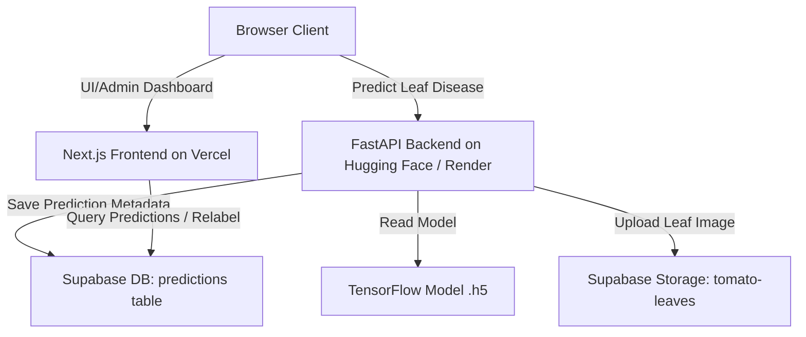

# Deployment Guide

This guide explains how to deploy the **Web-based Tomato Leaf Disease Identification System** to production.

---

## 🏗️ Architecture Overview

The system is split into three main components:
1. **Frontend (Next.js + Tailwind CSS):** Deployed to **Vercel** for fast, edge-rendered pages.
2. **Backend (FastAPI + TensorFlow):** Deployed to **Hugging Face Spaces** or **Render** (via Docker) to accommodate the large TensorFlow machine learning model (>500MB).
3. **Database & Storage (Supabase):** Used for storing model predictions, audit records, and uploading images of diseased leaves.



---

## 📦 1. Supabase Database & Storage Setup

Before deploying the frontend or backend, ensure your Supabase instance is configured properly.

### A. Predictions Table Schema
Run the following SQL in your Supabase SQL Editor:

```sql
create table predictions (
  id uuid primary key default gen_random_uuid(),
  storage_path text not null,
  image_url text,
  predicted_label text not null,
  confidence double precision not null,
  final_label text, -- Used for manual administrator relabeling
  uploader_name text default 'anonymous',
  created_at timestamp with time zone default timezone('utc'::text, now()) not null,
  updated_at timestamp with time zone default timezone('utc'::text, now()) not null
);

-- Enable Row Level Security (RLS) or disable/configure policies depending on access requirements
alter table predictions enable row level security;

-- Create policies (Example: Allow anyone to select, and authenticated service role or custom policy for insert/delete)
create policy "Allow public select access" on predictions
  for select using (true);

create policy "Allow all actions for service role" on predictions
  to service_role
  using (true)
  with check (true);
```

### B. Storage Bucket
1. Go to the **Storage** section in your Supabase Dashboard.
2. Create a new bucket named `tomato-leaves`.
3. Set the bucket to **Public** (so the frontend can display image previews via their public URL).

---

## 🐍 2. Deploying the Python Backend (FastAPI + TensorFlow)

Since Vercel has a strict **50MB (Free) / 250MB (Pro)** package size limit, the heavy TensorFlow library (~500MB+) and model file (~19MB-57MB) cannot be hosted directly inside Vercel serverless functions. 

Instead, we recommend hosting the backend using **Docker** on one of the following platforms:

### Option A: Hugging Face Spaces (Recommended - 100% Free)
Hugging Face Spaces offers a free Docker tier with **16GB RAM and 2 vCPUs**, which runs TensorFlow models smoothly with zero charge and no cold-start timeouts.

1. Create a free account at [Hugging Face](https://huggingface.co/).
2. Click **New Space** and configure:
   - **Space Name:** `tomato-disease-api` (or custom)
   - **SDK:** Choose **Docker** (Blank template).
   - **Space Hardware:** `CPU basic (Free, 16GB RAM)`.
   - **Privacy:** `Public` (so your frontend can communicate with it).
3. Create the Space.
4. Clone or push your workspace files to the Hugging Face Space Git repository.
   *Note: Ensure the `backend` directory contents are the root of your Hugging Face Space repository, so that the `Dockerfile` we created is at the root level.*
5. Set up **Repository Secrets** in the Settings tab of your Space:
   - `SUPABASE_URL` = `https://your-supabase-url.supabase.co`
   - `SUPABASE_SERVICE_KEY` = `your-supabase-service-role-key`
6. Hugging Face will build the Docker container automatically and give you a public URL (e.g., `https://username-space-name.hf.space`).

### Option B: Render Web Service
1. Create an account at [Render](https://render.com/).
2. Create a **New Web Service** and connect your GitHub repository.
3. Configure the service:
   - **Root Directory:** `backend`
   - **Runtime:** `Docker`
   - **Instance Type:** `Free` (or a paid tier to avoid cold starts)
4. Add the following **Environment Variables** in the Render Dashboard:
   - `SUPABASE_URL` = `https://your-supabase-url.supabase.co`
   - `SUPABASE_SERVICE_KEY` = `your-supabase-service-role-key`
5. Deploy. Render will build the container from `backend/Dockerfile` and provide a URL (e.g., `https://my-backend.onrender.com`).

---

## ⚡ 3. Deploying the Frontend (Next.js) on Vercel

Vercel is the natural choice for deploying the Next.js frontend.

### Step-by-Step Vercel Deployment:
1. Push your code to a GitHub, GitLab, or Bitbucket repository.
2. Log in to [Vercel](https://vercel.com/) and click **Add New > Project**.
3. Import your repository.
4. In the configuration screen:
   - **Framework Preset:** `Next.js` (automatically detected).
   - **Root Directory:** Click **Edit** and select the `frontend` folder.
5. Expand the **Environment Variables** section and add:
   - `NEXT_PUBLIC_SUPABASE_URL` = `https://your-supabase-url.supabase.co`
   - `NEXT_PUBLIC_SUPABASE_ANON_KEY` = `your-supabase-anon-key`
   - `NEXT_PUBLIC_BACKEND_URL` = `https://your-backend-api-url` (Exclude the trailing `/predict` or `/` - e.g., `https://username-space-name.hf.space` or `https://my-backend.onrender.com`)
6. Click **Deploy**.

Vercel will build the frontend and provide your live application link!

---

## 🧪 4. Testing Your Production Deployment

Once both systems are deployed:
1. Open the Vercel frontend URL.
2. Go to the prediction page (`/fito`).
3. Upload a tomato leaf image and click **Analyze Disease**.
4. The frontend will hit `NEXT_PUBLIC_BACKEND_URL/predict`, upload the image, get predictions, and log the results into Supabase.
5. Log in to the Admin Dashboard (`/admin`) on your frontend to see the statistics updating in real time!
